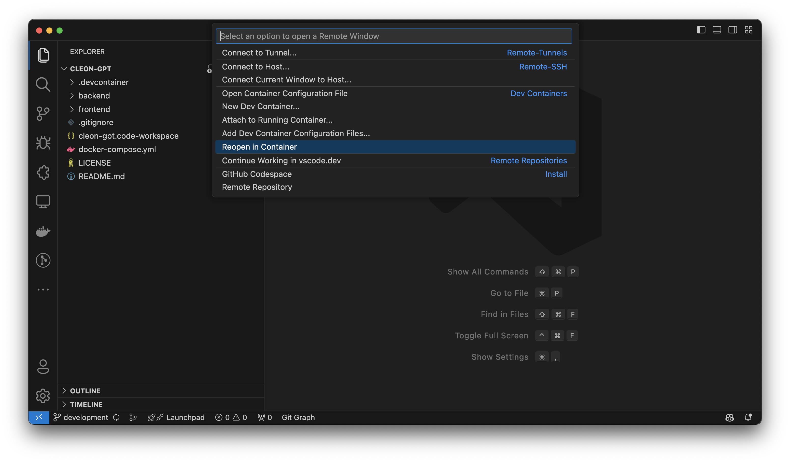
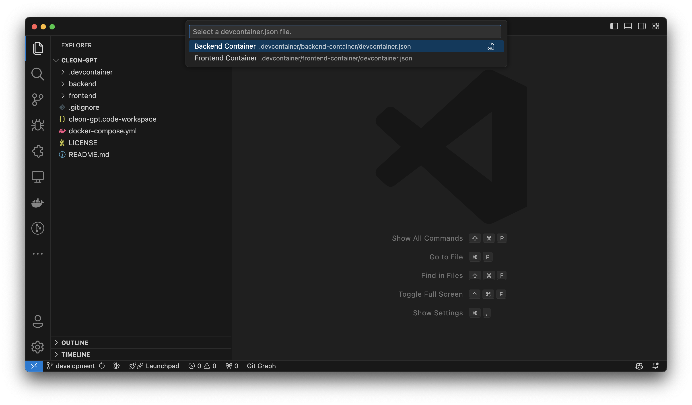
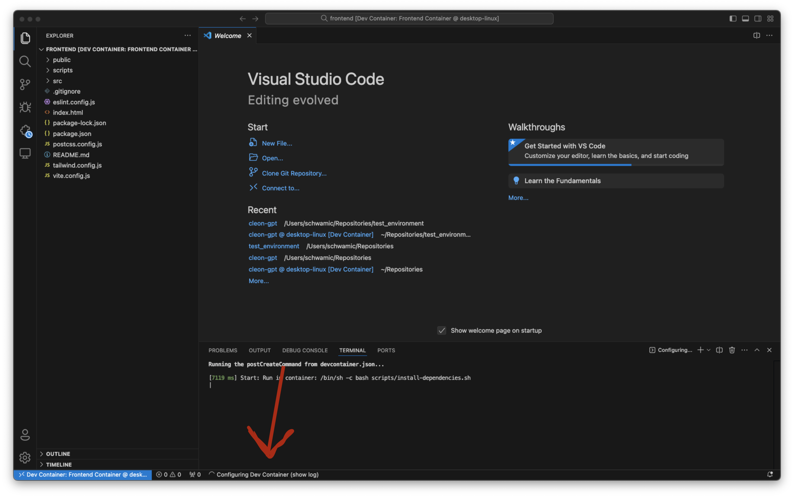
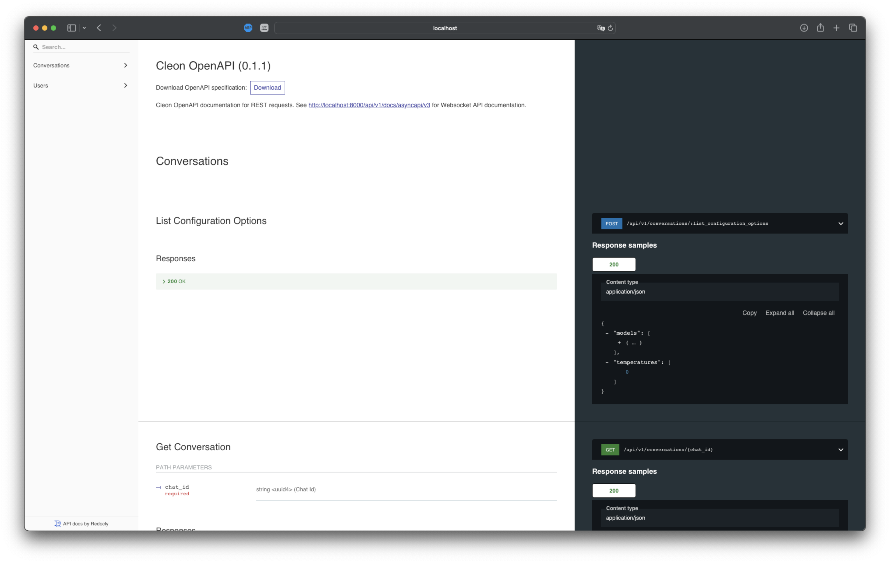
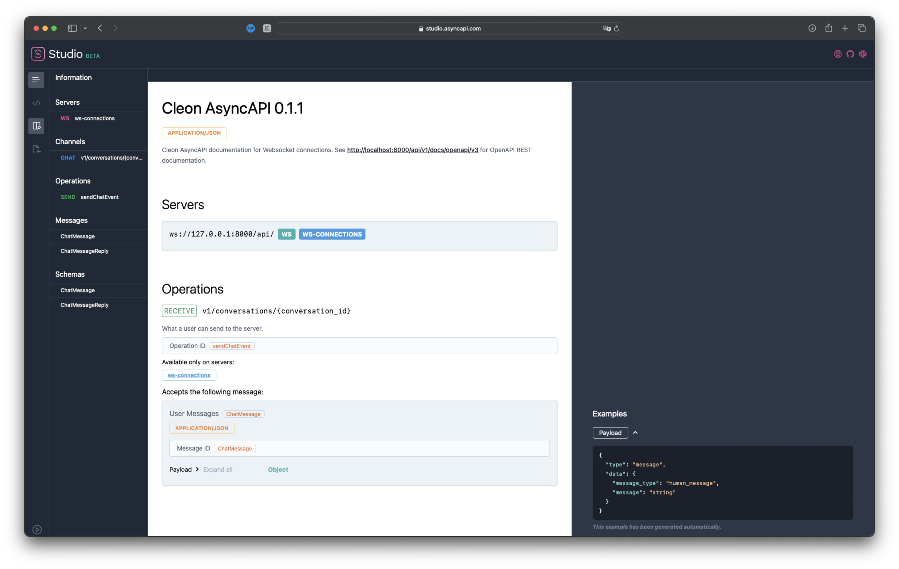

# Cleon Server

## Local Development

1. Open VS Code
2. Open backend project as DevContainer: `Reopen in Container -> Backend Container`

3. Wait until VS Code has configured DevContainer – this can take a while

4. Add a `.env` file ([env.example](env.example))
5. Open new terminal in VS Code
6. Activate python environment in the terminal via `source .venv/bin/activate` and check via `which python`
7. Run tests via `./manage.py test .`
8. Start development server via `./manage.py runserver` and open `http://127.0.0.1:8000/api/v1/docs/openapi/v3/` or `http://127.0.0.1:8000/api/v1/docs/asyncapi/v3/`

### Troubleshooting

1. Not able to load `.env`: Close the terminal and open it again. Make shure you are in the right environment `which python` (`source .venv/bin/activate`).

## Database Migrations

Here are the basics commands for handling the dev database:

1. Run `./manage.py makemigrations`
2. Run `./manage.py migrate`
3. Run `./manage.py createsuperuser`: `{username: cleon, password: thp.F26zeJ}`
4. Run `./manage.py runscript seed_database`
