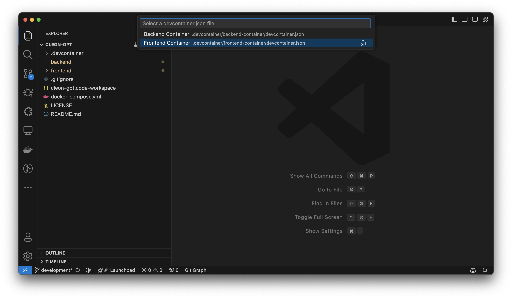
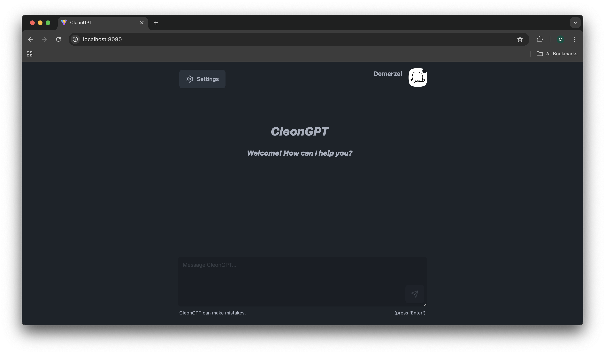

# Cleon App

## Local Development

1. Open VS Code
2. Open backend project as DevContainer: `Reopen in Container -> Frontend Container`

3. Wait until VS Code has configured DevContainer – this can take a while
4. Add a `.env` file ([env.example](env.example))
5. Open new terminal in VS Code
6. Start server via `npm run dev` at `http://127.0.0.1:8080/`

### Troubleshooting

1. If you get an error like `Bus error`, delete node_modules and install dependencies again via `npm install`
